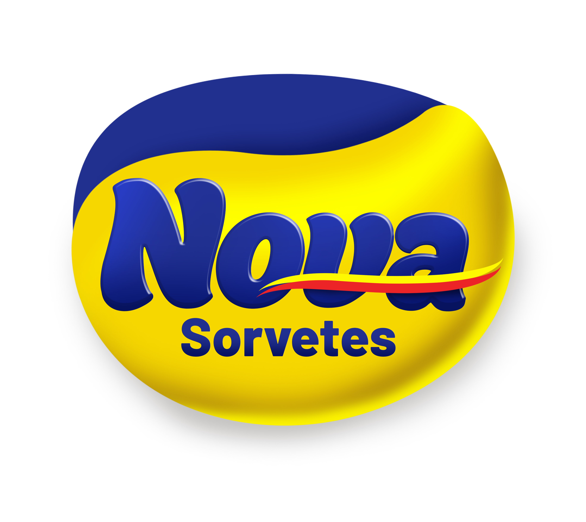
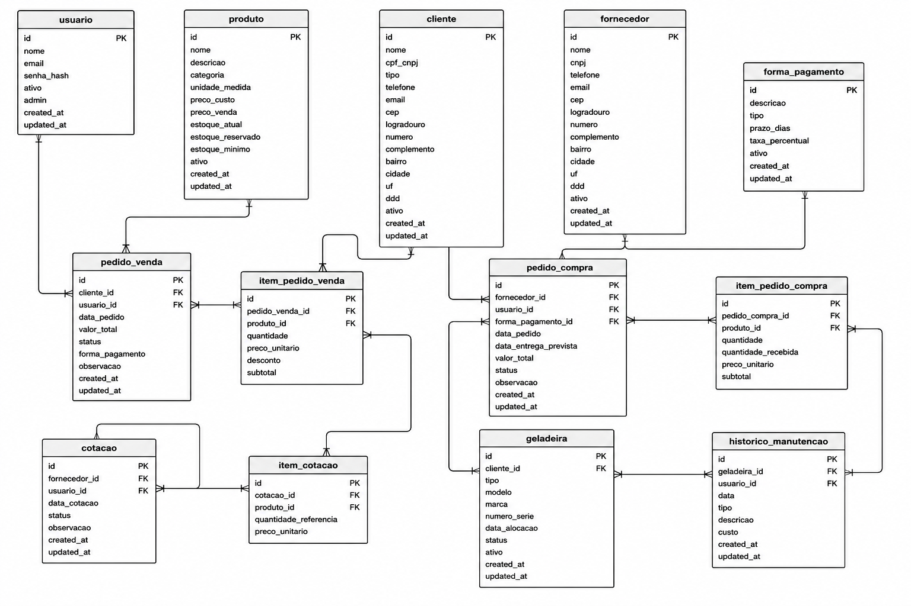

# Sistema de Gestão de Estoque e Monitoramento de Equipamentos

Sistema de gestão de estoque desenvolvido para a empresa [Nova Sorvetes](https://www.instagram.com/nova_sorvetes/), localizada em Itapira – SP, com o objetivo de substituir o controle manual por planilhas por uma solução informatizada, centralizada e rastreável.



> **Status do projeto:** Backend completo e testado. Frontend funcional em fase de revisão (CQA). Containerização via Docker planejada para após a aprovação do CQA.

---

## Sumário

- [Visão Geral](#visão-geral)
- [Módulos do Sistema](#módulos-do-sistema)
- [Modelo de Dados](#modelo-de-dados)
- [Regras de Negócio](#regras-de-negócio)
- [Arquitetura](#arquitetura)
- [Estrutura de Pastas](#estrutura-de-pastas)
- [Como Executar o Projeto](#como-executar-o-projeto)
- [Migrações de Banco de Dados (Alembic)](#migrações-de-banco-de-dados-alembic)
- [Roadmap](#roadmap)
- [Sobre o Projeto](#sobre-o-projeto)
- [Stack Utilizada](#stack-utilizada)

---

## Visão Geral

O sistema entrega uma solução simples e funcional para o controle de estoque e o monitoramento de equipamentos refrigerados (geladeiras e freezers) alocados nos clientes da empresa. Com ele, é possível:

- Controlar entradas e saídas de produtos via pedidos de compra e venda, com reserva automática de estoque;
- Cadastrar clientes e fornecedores com preenchimento automático de endereço via CEP;
- Comparar cotações entre fornecedores para identificar o melhor custo-benefício;
- Registrar formas de pagamento e prazos associados às compras;
- Acompanhar os equipamentos alocados em cada cliente e seu histórico de manutenção.

---

## Módulos do Sistema

| Módulo | Responsabilidade | Status |
|---|---|---|
| **Autenticação** | Login via JWT, controle de permissões (usuário comum / admin) | ✅ Completo |
| **Controle de Estoque** | Cadastro de produtos, clientes e fornecedores; pedidos de compra e venda; atualização automática do saldo em estoque | ✅ Completo |
| **Cotação de Produtos** | Registro de cotações por fornecedor e comparativo de preços por produto | ✅ Completo |
| **Formas de Pagamento** | Cadastro das modalidades de pagamento (à vista, parcelado, a prazo) | ✅ Completo |
| **Monitoramento de Equipamentos** | Cadastro de geladeiras/freezers alocados a clientes e histórico de manutenções | ✅ Completo |
| **Frontend** | Interface web consumindo a API, em fase de revisão (CQA) | 🔄 Em revisão |
| **Containerização** | Empacotamento via Docker e Docker Compose | 🕐 Aguardando CQA |

---

## Modelo de Dados

O modelo relacional é composto por **13 entidades**, estruturadas a partir de um Diagrama Entidade-Relacionamento (DER) e distribuídas em quatro domínios funcionais:

- **Cadastros base:** `usuario`, `produto`, `cliente`, `fornecedor`, `forma_pagamento`
- **Controle de estoque:** `pedido_venda`, `item_pedido_venda`, `pedido_compra`, `item_pedido_compra`
- **Cotação:** `cotacao`, `item_cotacao`
- **Monitoramento:** `geladeira`, `historico_manutencao`



### Produto

| Campo | Descrição |
|---|---|
| `id` | Chave primária |
| `nome`, `descricao`, `categoria`, `unidade_medida` | Identificação e categorização |
| `preco_custo`, `preco_venda` | Precificação |
| `estoque_atual` | Quantidade física real, atualizada pelo fluxo de pedidos |
| `estoque_reservado` | Quantidade comprometida em pedidos de venda ainda não confirmados |
| `estoque_minimo` | Utilizado para alertas de reposição |
| `ativo` | Soft delete |
| `created_at`, `updated_at` | Auditoria |

> O estoque disponível para venda é sempre calculado como `estoque_atual - estoque_reservado`, exposto na API como o campo computado `estoque_disponivel`. Veja [Regras de Negócio](#regras-de-negócio) para o racional completo.

### Cliente / Fornecedor

| Campo | Descrição |
|---|---|
| `id` | Chave primária |
| `nome`, `cpf_cnpj` (ou `cnpj`), `tipo`, `telefone`, `email` | Dados cadastrais |
| `cep`, `logradouro`, `numero`, `complemento`, `bairro`, `cidade`, `uf`, `ddd` | Endereço, preenchido via [API ViaCEP](https://viacep.com.br/) |
| `ativo` | Soft delete |
| `created_at`, `updated_at` | Auditoria |

### Pedido de Venda

| Campo | Descrição |
|---|---|
| `id` | Chave primária |
| `cliente_id`, `usuario_id` | Chaves estrangeiras |
| `data_pedido`, `valor_total`, `status`, `forma_pagamento`, `observacao` | Dados da transação |
| `status` | `aberto` \| `confirmado` \| `cancelado` |

### Pedido de Compra

| Campo | Descrição |
|---|---|
| `id` | Chave primária |
| `fornecedor_id`, `usuario_id`, `forma_pagamento_id` | Chaves estrangeiras |
| `data_pedido`, `data_entrega_prevista`, `valor_total`, `status`, `observacao` | Dados da transação |
| `status` | `pendente` \| `recebido` \| `cancelado` |

### Item Pedido Venda / Item Pedido Compra

Tabelas intermediárias que viabilizam a relação um-para-muitos entre pedidos e produtos.

| Campo | Descrição |
|---|---|
| `id` | Chave primária |
| `pedido_venda_id` / `pedido_compra_id` | Chave estrangeira |
| `produto_id` | Chave estrangeira |
| `quantidade`, `preco_unitario`, `subtotal` | Dados do item |
| `desconto`* | Apenas item de venda |
| `quantidade_recebida`* | Apenas item de compra — acumulado já recebido fisicamente |

> **Por que tabelas intermediárias?** Pedidos podem conter múltiplos produtos. Em vez de repetir colunas no cabeçalho do pedido, cada item é armazenado em sua própria linha, vinculado ao pedido e ao produto correspondente — garantindo normalização e evitando redundância de dados.

### Cotação / Item Cotação

| Campo | Descrição |
|---|---|
| `id` | Chave primária |
| `fornecedor_id`, `usuario_id` | Chaves estrangeiras |
| `data_cotacao`, `status`, `observacao` | Dados da cotação |
| `produto_id`, `preco_unitario`, `quantidade_referencia` | Itens cotados |

### Forma de Pagamento

| Campo | Descrição |
|---|---|
| `id` | Chave primária |
| `descricao`, `tipo` | À vista, parcelado ou a prazo |
| `prazo_dias`, `taxa_percentual` | Condições da modalidade |
| `ativo` | Soft delete |

### Usuário

| Campo | Descrição |
|---|---|
| `id` | Chave primária |
| `nome`, `email`, `senha_hash` | Autenticação (senha armazenada com hash bcrypt) |
| `ativo`, `admin` | Controle de acesso e nível de permissão |
| `created_at`, `updated_at` | Auditoria |

### Geladeira / Histórico de Manutenção

O endereço da geladeira não é replicado — é sempre obtido a partir do cliente ao qual está alocada (`cliente_id`), evitando duplicidade e inconsistência de dados.

| Campo | Descrição |
|---|---|
| `id` | Chave primária |
| `cliente_id` | Chave estrangeira — define a localização do equipamento |
| `tipo`, `modelo`, `marca`, `numero_serie`, `status` | Identificação do equipamento (`em_campo` \| `manutencao` \| `desativada`) |
| `geladeira_id`, `usuario_id`, `data`, `tipo`, `descricao`, `custo` | Registro de manutenções (tabela `historico_manutencao`) |

---

## Regras de Negócio

Estas são as decisões de design que vão além de um CRUD simples — vale documentá-las, pois representam grande parte do valor técnico do projeto.

### Reserva de estoque em pedidos de venda

Sem controle de concorrência, dois pedidos abertos simultaneamente para o mesmo produto poderiam, juntos, vender mais do que existe fisicamente em estoque. Para resolver isso, o produto mantém dois contadores:

- `estoque_atual` — quantidade física real (só muda na efetiva entrada/saída de mercadoria);
- `estoque_reservado` — soma das quantidades comprometidas em pedidos de venda com status `aberto`.

O fluxo funciona assim:

| Transição | Efeito no estoque |
|---|---|
| Criar pedido (`→ aberto`) | Valida `estoque_atual - estoque_reservado` (disponível); incrementa `estoque_reservado` |
| `aberto → confirmado` | Libera a reserva (`estoque_reservado -=`) e debita o físico (`estoque_atual -=`) |
| `aberto → cancelado` | Libera a reserva, sem afetar o físico |
| `confirmado → cancelado` | Devolve o físico (`estoque_atual +=`) |

Isso impede que um segundo pedido reserve uma quantidade que já está comprometida por outro pedido em aberto — o bloqueio ocorre já na criação, não apenas na confirmação.

### Recebimento parcial e acumulativo em pedidos de compra

Entregas de fornecedores raramente chegam 100% completas de uma vez — avarias, divergências e reposições parciais são comuns. Por isso, cada item de um pedido de compra rastreia `quantidade` (pedida) separadamente de `quantidade_recebida` (acumulado já recebido).

O endpoint `POST /pedidos-compra/{id}/receber` pode ser chamado múltiplas vezes para o mesmo pedido, sempre informando apenas a quantidade daquela entrega específica (não o total acumulado). Cada chamada credita no estoque exatamente o que chegou naquele momento. O pedido permanece `pendente` enquanto qualquer item estiver incompleto, e muda automaticamente para `recebido` somente quando todos os itens atingem a quantidade total pedida.

O cancelamento (`pendente → cancelado` ou `recebido → cancelado`) estorna do estoque exatamente o que havia sido recebido até então, com validação para impedir que o estoque fique negativo caso parte da mercadoria já tenha sido vendida.

### Controle de acesso por perfil

O sistema diferencia dois perfis de usuário, controlados pelo campo `admin` no JWT gerado no login:

- **Administrador** — acesso completo ao sistema, incluindo o dashboard com métricas, a gestão de usuários e todas as demais telas. Restrições de segurança: um admin não pode desativar a própria conta nem remover a própria permissão de administrador pela interface.
- **Usuário comum** — acesso a todas as telas operacionais (produtos, clientes, fornecedores, pedidos, cotações, geladeiras, formas de pagamento), sem acesso ao dashboard e à gestão de usuários.

A proteção é aplicada em dois níveis: no frontend (redirecionamento automático e ocultação de itens do menu) e no backend (endpoint `GET /usuarios/` exige `admin = True` via `get_admin_user`).

### Soft delete e auditoria

Produtos, clientes, fornecedores, usuários e formas de pagamento nunca são removidos permanentemente — são marcados como `ativo = False`, preservando o histórico de pedidos, cotações e manutenções que os referenciam. Cada módulo expõe um endpoint `/inativos` e um parâmetro `?incluir_inativos=true` para consulta administrativa, permitindo reativação posterior.

Cotações e registros de manutenção, por não estarem vinculados a transações já efetivadas, permitem exclusão real.

---

## Arquitetura

```
Frontend (HTML/CSS/JS)
        │
        ▼
Backend (FastAPI)
   ├── routes/    → Endpoints REST
   ├── schemas/   → Validação de entrada/saída (Pydantic)
   ├── core/      → Autenticação e segurança (JWT)
   └── models.py  → Mapeamento ORM (SQLAlchemy)
        │
        ▼
Banco de Dados (MySQL)
```

A comunicação entre frontend e backend ocorre via requisições HTTP/JSON consumindo a API REST exposta pelo FastAPI. A autenticação é feita por token JWT (Bearer), com diferenciação entre usuários comuns e administradores.

---

## Estrutura de Pastas

```
sist_gest_est_mon/
├── backend/
│   ├── alembic/                   # Migrações de schema do banco de dados
│   │   ├── versions/
│   │   └── env.py
│   ├── core/
│   │   └── security.py            # Autenticação JWT e dependências de permissão
│   ├── routes/                    # Endpoints da API, um arquivo por entidade
│   ├── schemas/                   # Modelos Pydantic de entrada/saída
│   ├── alembic.ini                # Configuração do Alembic
│   ├── database.py                # Configuração de conexão com o MySQL
│   ├── models.py                  # Modelos ORM (SQLAlchemy)
│   ├── create_tables.py           # Script de criação inicial das tabelas
│   ├── main.py                    # Inicialização da aplicação FastAPI
│   └── requirements.txt           # Dependências do projeto
├── frontend/
│   ├── assets/
│   │   └── images/                # Logotipo e imagens do projeto
│   ├── css/                       # Folhas de estilo (base, sidebar, módulos)
│   ├── js/
│   │   ├── core/                  # Infraestrutura: api.js, auth.js, config.js, mascaras.js
│   │   ├── components/            # sidebar.js (navegação colapsável)
│   │   ├── pages/                 # Lógica específica de cada tela
│   │   └── services/              # Camada de comunicação com a API (um arquivo por entidade)
│   └── pages/                     # Arquivos HTML de cada tela do sistema
├── .gitignore
└── README.md
```

---

## Como Executar o Projeto

**Pré-requisitos:** Python 3.12+, MySQL Server, Git

```bash
# 1. Clonar o repositório
git clone <url-do-repositorio>
cd sist_gest_est_mon/backend

# 2. Criar e ativar o ambiente virtual
python -m venv venv
venv\Scripts\activate        # Windows
# source venv/bin/activate   # Linux/Mac

# 3. Instalar as dependências
pip install -r requirements.txt

# 4. Configurar variáveis de ambiente
# Crie um arquivo .env na pasta backend/ com:
#   DB_USER=root
#   DB_PASSWORD=sua_senha
#   DB_HOST=localhost
#   DB_PORT=3306
#   DB_NAME=sist_gest_est_mon
#   SECRET_KEY=sua_chave_secreta
#   ALGORITHM=HS256
#   ACCESS_TOKEN_EXPIRE_HOURS=8

# 5. Criar o banco de dados no MySQL
# CREATE DATABASE sist_gest_est_mon CHARACTER SET utf8mb4 COLLATE utf8mb4_unicode_ci;

# 6. Criar as tabelas
python create_tables.py

# 7. Subir o servidor
uvicorn main:app --reload
```

A documentação interativa da API estará disponível em `http://127.0.0.1:8000/docs`.

Para acessar o frontend, abra `frontend/pages/login.html` no navegador (via Live Server do VS Code ou qualquer servidor HTTP estático).

---

## Migrações de Banco de Dados (Alembic)

A partir da estabilização do modelo de dados, alterações de schema passaram a ser versionadas via [Alembic](https://alembic.sqlalchemy.org/), em vez de comandos manuais no banco. Isso garante que qualquer pessoa do grupo consiga aplicar exatamente as mesmas mudanças de estrutura, na ordem correta.

```bash
# Gerar uma nova migração após alterar models.py
alembic revision --autogenerate -m "descricao da mudanca"

# Revisar o arquivo gerado em alembic/versions/ antes de aplicar

# Aplicar a migração ao banco
alembic upgrade head
```

> **Nota técnica:** como a senha do banco contém o caractere `%` (proveniente de URL encoding), foi necessário escapá-lo como `%%` ao configurar a URL de conexão em `alembic/env.py`, pois o `configparser` do Python interpreta `%` como início de uma sintaxe de interpolação.

---

## Roadmap

### CQA — Revisão geral em andamento

O grupo está realizando uma revisão completa (CQA) do sistema para identificar pontos de melhoria, ajustes de regras de negócio e possíveis novas funcionalidades antes da versão final. Alterações decorrentes do CQA poderão envolver mudanças no modelo de dados, endpoints e telas.

### Containerização com Docker (aguardando CQA)

A aplicação será empacotada em três containers independentes, orquestrados via Docker Compose:

- **Backend** — imagem Python 3.12 rodando FastAPI/Uvicorn;
- **Frontend** — imagem Nginx servindo os arquivos estáticos;
- **MySQL** — imagem oficial do banco de dados.

O objetivo é permitir que o sistema completo seja inicializado com um único comando (`docker-compose up`), eliminando a necessidade de configuração manual de ambiente em máquinas de desenvolvimento ou na avaliação do projeto.

### Outras evoluções futuras

Conforme indicado no artigo original do TCC e nas discussões de desenvolvimento: integração com módulos de fluxo de caixa e contas a pagar/receber, painel de indicadores (KPIs/dashboard), acesso via aplicativo móvel, e monitoramento de temperatura das geladeiras via sensores IoT.

---

## Sobre o Projeto

Este sistema está sendo desenvolvido como Trabalho de Conclusão de Curso (TCC) da [UniFAJ](https://unifaj.grupounieduk.com.br/), com o objetivo de aplicar em um caso real os conceitos estudados ao longo da graduação.

---

## Stack Utilizada

<div style="display: flex; flex-wrap: wrap; gap: 8px;">


</div>